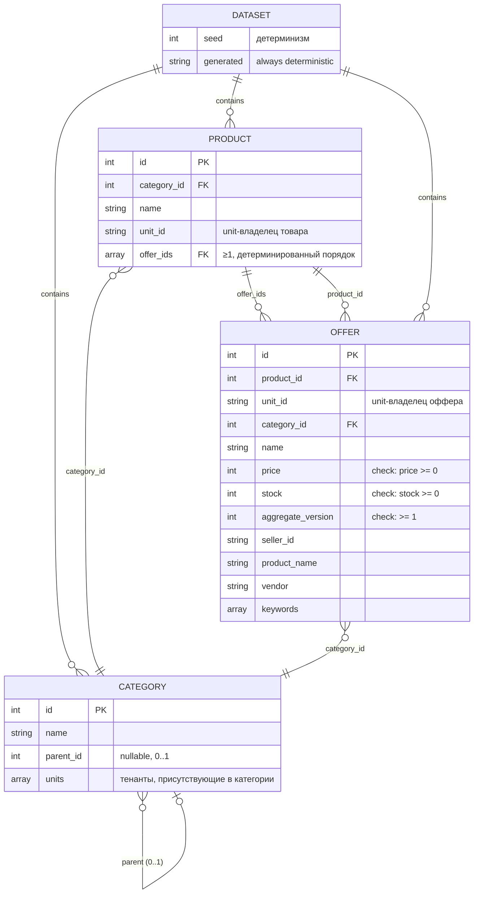

# ERD-001 — Модель данных golden-датасета каталога

> Описывает логическую модель данных, которую генерирует `cmd/gen` (FR-005, BDD-032#S-8, S-9).
> Датасет — статичный синтетический артефакт (JSON-файл), а не БД: сущности
> соответствуют структурам кода и JSON, а не таблицам Postgres. Mermaid — для
> человека, YAML-таблица ниже — машиночитаемая для парсера/кодогенерации.

## 1. Диаграмма (для человека)



## 2. Сущности (для парсера)

```yaml
entities:
  - name: Dataset
    description: Корень golden-датасета; манифест с seed и счётчиками
    fields:
      - name: seed
        type: int
        pk: false
        nullable: false
        description: seed генератора; детерминирует всё содержимое
      - name: generated
        type: string
        nullable: false
        description: всегда фиксированное значение "deterministic" (не timestamp!)

  - name: Category
    description: Категория каталога; дерево глубиной 2 (root + 28 листьев)
    fields:
      - name: id
        type: int
        pk: true
      - name: name
        type: string
        nullable: false
      - name: parent_id
        type: int
        nullable: true
        description: родитель; null для root-категории
      - name: units
        type: array(string)
        nullable: false
        description: unit-тенанты, доступные в категории (для распределения офферов)

  - name: Product
    description: Товар каталога; принадлежит ровно одному unit и одной категории
    fields:
      - name: id
        type: int
        pk: true
      - name: category_id
        type: int
        nullable: false
        fk: { entity: Category, column: id }
      - name: name
        type: string
        nullable: false
      - name: unit_id
        type: string
        nullable: false
        description: unit-владелец товара
      - name: offer_ids
        type: array(int)
        nullable: false
        description: офферы товара (≥ 1), первый всегда оффер unit-владельца

  - name: Offer
    description: Оффер (товарное предложение); может принадлежать другому unit (multi-seller)
    fields:
      - name: id
        type: int
        pk: true
      - name: product_id
        type: int
        nullable: false
        fk: { entity: Product, column: id }
      - name: unit_id
        type: string
        nullable: false
        description: unit-владелец оффера; от 1 до 4 разных unit на один товар
      - name: category_id
        type: int
        nullable: false
        fk: { entity: Category, column: id }
      - name: name
        type: string
        nullable: false
      - name: price
        type: int
        nullable: false
        check: "price >= 0"
      - name: stock
        type: int
        nullable: false
        check: "stock >= 0"
      - name: aggregate_version
        type: int
        nullable: false
        check: "aggregate_version >= 1"
        description: версия агрегата для тестов projection (не откатывать read model устаревшими событиями)
      - name: seller_id
        type: string
        nullable: false
        description: продавец (должен соответствовать unit_id)
      - name: product_name
        type: string
        nullable: false
        description: денормализация product.name (для поисковых сценариев)
      - name: vendor
        type: string
        nullable: false
      - name: keywords
        type: array(string)
        nullable: false
        description: поисковые ключи (имя товара + имя категории)
```

## 3. Связи (для парсера)

```yaml
relationships:
  - from: Dataset
    to: Category
    cardinality: 1:N
    label: contains
  - from: Dataset
    to: Product
    cardinality: 1:N
    label: contains
  - from: Dataset
    to: Offer
    cardinality: 1:N
    label: contains
  - from: Category
    to: Category
    cardinality: 0..1:1
    label: parent
    on_delete: restrict
  - from: Product
    to: Category
    cardinality: N:1
    label: category_id
  - from: Product
    to: Offer
    cardinality: 1:N
    label: offer_ids
  - from: Offer
    to: Product
    cardinality: N:1
    label: product_id
  - from: Offer
    to: Category
    cardinality: N:1
    label: category_id
```

## 4. Инварианты и ограничения

- INV-1 (детерминизм, FR-005/BDD S-9): одинаковый `seed` + одинаковые параметры → байт-идентичный файл датасета (порядок обхода фиксирован, случайность — только внутри генератора с заданным seed; `generated` не содержит времени). Проверяется sha256 манифеста.
- INV-2 (объём, FR-005/BDD S-8): `len(products) >= 1000`; валидация отклоняет меньшее количество.
- INV-3 (multi-unit/multi-offer, FR-005/BDD S-8): каждый товар имеет офферы от ≥ 1 unit, при этом существуют товары с офферами от ≥ 2 разных unit; первый оффер товара всегда принадлежит unit-владельцу товара.
- INV-4 (ссылочная целостность): `offer.product_id`, `product.category_id`, `offer.category_id` всегда ссылаются на существующие сущности; `product.offer_ids` в точности равен набору офферов с данным `product_id` (в том же порядке).
- INV-5 (счётчики): `len(dataset.offers) == sum(len(p.offer_ids))`; ID офферов и товаров уникальны и возрастают (продукт: 1..N, оффер: 1..M).
- INV-6 (агрегат, FR-004-смежное): `offer.aggregate_version >= 1` и монотонен для каждого (product_id, unit_id) — имитирует поток событий каталога для тестов projection.
- INV-7 (тенант): `offer.seller_id` детерминированно выводится из `offer.unit_id` (`seller-<unit_id>`), чтобы тесты изоляции тенантов были воспроизводимы.

## 5. Стратегия миграций

Не применимо: датасет — статичный артефакт, а не БД. Изменение формата = новая версия
`Dataset.generated`-схемы + перегенерация с тем же seed; старая версия датасета хранится
до тех пор, пока её потребляют тесты.

## 6. PII / Безопасность

| Поле | Класс | Примечание |
|------|-------|------------|
| product.name, offer.name, keywords | НЕ PII | синтетические данные; использование реальных фидов (docs/data/gold) требует проверки на персональные данные при импорте |

## 7. Открытые вопросы

- [ ] Q-1 (PRD-032 Q-3): нужен ли отдельный увеличенный датасет (≥ 100k) для load-тестов или один на все цели — формат допускает оба, вопрос к `-products`-параметру.
